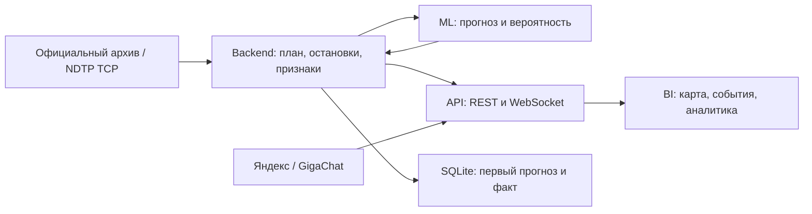

# Transit Hub — техническая документация

Transit Hub принимает телеметрию транспорта, сопоставляет её с планом движения, рассчитывает прогноз прибытия к остановке и передаёт результат в диспетчерский BI. [Инструкция для жюри](JURY_QUICKSTART.md) описывает запуск и проверку, [материалы для формы](SUBMISSION.md) содержат готовые ссылки, [отчёт по возможностям](docs/additional-features-report.md) — функции и измеренную производительность.

## Архитектура и модули

Три функциональных модуля — ML, Backend, BI — развёрнуты четырьмя сервисами в [compose.official.yaml](compose.official.yaml). API-шлюз входит в серверный модуль и обеспечивает REST, WebSocket и интеграции.



| Сервис | Назначение | Адрес после запуска Docker |
|---|---|---|
| `frontend` | React-интерфейс и Nginx, 2D/3D-карта, аналитика, диспетчер, отчёты | [Дашборд](http://127.0.0.1:8080/overview?source=official) |
| `api` | Node.js, REST, WebSocket, команды и внешние сервисы | [Health](http://127.0.0.1:8081/api/v1/health) |
| `backend` | FastAPI, NDTP-приёмник, сопоставление с планом, прогнозы, журнал исходов | [Статус](http://127.0.0.1:8093/status), TCP `127.0.0.1:9201` |
| `ml` | FastAPI, загрузка весов, признаки OSM и пакетный инференс | [ML health](http://127.0.0.1:8092/health) |

## Сгенерированная документация

После запуска откройте [единый каталог](http://127.0.0.1:8080/docs/). Статические страницы входят в frontend-образ и доступны вместе с дашбордом.

| Материал | В работающем приложении | Файлы в репозитории |
|---|---|---|
| PyDoc: Python-модули, классы, функции | [HTML PyDoc](http://127.0.0.1:8080/docs/python/) | [Сгенерированные страницы](public/docs/python/index.html) |
| OpenAPI/Swagger: Backend | [Swagger сервиса](http://127.0.0.1:8093/docs), [копия схемы и описание](http://127.0.0.1:8080/docs/api/backend.html) | [OpenAPI JSON](public/docs/api/backend-openapi.json) |
| OpenAPI/Swagger: ML | [Swagger сервиса](http://127.0.0.1:8092/docs), [копия схемы и описание](http://127.0.0.1:8080/docs/api/ml.html) | [OpenAPI JSON](public/docs/api/ml-openapi.json) |
| OpenAPI/Swagger: API-шлюз | [Swagger](http://127.0.0.1:8080/docs/api/gateway.html), [JSON сервиса](http://127.0.0.1:8081/api/v1/openapi.json) | [Контракт](contracts/integration-openapi.json) |
| WebSocket-события | `ws://127.0.0.1:8081/api/v1/stream` | [AsyncAPI](contracts/asyncapi.yaml) |

Swagger сервиса позволяет выполнять запросы к запущенному Backend/ML. Статические Swagger-страницы предназначены для просмотра контрактов. Репозиторий хранит исходники HTML; браузерное представление открывается по адресам запущенного приложения.

Обновление документации из текущего кода после установки Python-зависимостей:

```sh
ml/.venv/bin/python scripts/build-python-docs.py
PYTHONPATH=ml:src ml/.venv/bin/python scripts/build-api-docs.py
```

PyDoc включает Backend, ML, NDTP, сопоставление участков, признаки, предупреждения, исходы, журнал оценки и проверку входного плана. OpenAPI Backend и ML генерируются непосредственно из FastAPI-приложений.

## Поток данных и временная логика

1. **Получение телеметрии.** В режиме `replay` Backend последовательно читает официальный архив по его временной шкале. В режиме `ndtp` принимает бинарные TCP-пакеты, проверяет CRC, восстанавливает фрагменты, извлекает координаты, скорость, курс и доступные признаки дверей.
2. **Сопоставление с планом.** `unit_id` сопоставляется с `tr_id` через `unit-map.json`; последовательность GPS-наблюдений — с посещениями остановок из плана. Определяются текущий участок, отклонение от расписания, скорость и стоянки.
3. **Прогноз.** Выбирается плановая остановка в окне `600 < time_begin − T <= 900` секунд. ML возвращает задержку в секундах и отдельную вероятность опоздания более 120 с.
4. **Предупреждение.** Для первого выпуска дополнительно проверяется окно `600 < event_time − T <= 900`, где `event_time = time_begin + 120 с`. Карточка содержит автобус, остановку, текущий участок, прогноз, вероятность, время первого сигнала и наблюдаемый фактор.
5. **Доставка и оценка.** REST и WebSocket передают завершённый срез. SQLite сохраняет первый успешный прогноз для цели и связывает его с последующим наблюдённым прибытием; аналитика рассчитывает MAE по подтверждённым парам.

`delaySec = время прибытия − план`: положительное значение означает опоздание, отрицательное — раннее прибытие. Даты и исходы воспроизводимы: [методика раннего предупреждения](docs/21-early-warning-evidence.md), [журнал прогноза и факта](docs/25-bi-and-fleet-validation.md).

## Входные данные NDTP

| Файл / поле | Содержание |
|---|---|
| `schedule_plan.csv` | План для дня и потока, выбранных для проверки |
| `tt_action_item_id` | Уникальный ID посещения остановки |
| `tr_id` | ID транспортного средства в плане |
| `time_begin` | Плановая отметка с явно заданной временной зоной, например `2026-09-28T08:10:00+03:00` |
| `geom` | WKT `POINT (longitude latitude)`, WGS84 |
| `building_address` | Отображаемое название/адрес остановки |
| `unit-map.json` | Объект `{"идентификатор NDTP-устройства": идентификатор tr_id}` |

Входной контракт живого режима — действующий план и подтверждённые назначения устройств от организатора/оператора. Архивный replay и интеграционный сценарий официального эмулятора имеют собственные явно обозначенные данные. [Проверка источника и подключение плана](docs/27-live-ndtp-plan-source.md) описывает получение файлов, сверку ID и времени; предзапусковая проверка формата:

```sh
PYTHONPATH=ml python3 -m transit_ml.live_plan --directory /absolute/path/current-plan
```

## Активная модель

Версия **`olya-extra-trees-osm-v1`** из `osm-extra-trees-51` использует 64 признака, в том числе 14 признаков исторического OpenStreetMap. На 353 предоставленных тестовых примерах MAE составляет **52,20 с**; сравниваемый вариант без OSM — **58,09 с**. Снимок OSM относится к 6 января 2026 и согласован с архивной телеметрией.

[ML-документация](ml/README.md), [интеграционный протокол и контрольная сумма весов](reports/olya-ml-integration-2026-09-27.json), [описание экспериментов](docs/ml_experiments_report.md), [файлы сабмита](submission/README.md).

## Основные интерфейсы

| Контур | Методы |
|---|---|
| Backend | `GET /snapshot`, `/catalog`, `/status`, `/warnings/audit`, `/analytics/forecast-evaluation` |
| ML | `GET /health`, `POST /predict/raw`, `POST /predict` |
| BI API | `GET /api/v1/routes`, `/vehicles`, `/forecast`, `/alerts`, `/network/summary` |
| Аналитика | `GET /api/v1/analytics/delay-series`, `/risk-distribution`, `/top-routes`, `/forecast-evaluation` |
| Диспетчер | `/api/v1/dispatch/recommendations`, `/commands`, `/advice`, `/driver-messages`, `/reports` |
| Дорожные события | `GET /api/v1/traffic/notifications`, `POST /api/v1/traffic/demo` |
| Мониторинг | `GET /api/v1/health`, `/api/v1/ml/status`, `/api/v1/integrations` |

В строках с общим префиксом пути перечислены относительно этого префикса; полный состав методов, параметров, тел и ответов — в OpenAPI. WebSocket публикует `system.hello`, `system.heartbeat`, обновления сети, маршрутов, ТС и прогнозов, удаления объектов, снимки алертов и аналитики. Каждый клиент получает последовательные номера событий и полный начальный срез; последующие изменения доставляются патчами.

## Интеграции и настройки

| Переменная | Назначение |
|---|---|
| `TELEMETRY_MODE` | `replay` или `ndtp` |
| `LIVE_PLAN_DIR` | Каталог входного плана и mapping для запуска |
| `REPLAY_START`, `REPLAY_SPEED` | Начальная отметка и темп чтения архива |
| `API_TOKEN` | Ключ авторизованных операций диспетчера |
| `YANDEX_WEATHER_KEY` | Серверная интеграция Яндекс Погоды |
| `GIGACHAT_AUTH_KEY`, `GIGACHAT_SCOPE`, `GIGACHAT_MODEL` | Подсказки, анализ дорожных событий и отчёты |
| `YANDEX_ROUTER_KEY`, `TRAFFIC_EVENTS_URL`, `TRAFFIC_EVENTS_TOKEN` | Адаптер маршрутизации и источник дорожных событий в Node API |

Ключи передаются через серверное окружение; `server/.env` исключён из Git. Для подключения дорожного источника к Docker API эти переменные задаются в `api.environment` локального Compose override. Интеграции описаны в [серверной документации](server/README.md), [мониторинге дорожных событий](docs/18-road-events.md) и [отчётах GigaChat](server/daily-reports.ts).

## Производительность и эксплуатация

Backend объединяет частые NDTP-события в пересчёты, ограничивает историю устройств и отдаёт последний завершённый срез параллельно расчёту ML. API ведёт состояние доставки отдельно для каждого WS-клиента; снимки передаются последовательно с ограниченными сроками отправки. Docker использует `restart: unless-stopped`, healthcheck и ротацию логов по три файла по 10 МБ на сервис; журналы команд и прогнозов размещены в постоянных томах.

[Отчёт по производительности и возможностям](docs/additional-features-report.md#9-производительность-и-отказоустойчивость) содержит все показатели текущего замера. [Протокол проверки](docs/28-karatai-reliability-review.md) фиксирует окружение, SHA-256 исходников и команды воспроизведения.

## Проверки проекта

Для версии `12b946f`: **155** тестов приложения/API, **146** Python-тестов и **5** браузерных проверок, проверки типов, lint и сборка прошли. Покрыты NDTP, временные окна, использование наблюдаемых данных, отказ и восстановление модели, журнал исходов, ошибки WebSocket, независимость клиентов и основные сценарии интерфейса.

```sh
pnpm check
pnpm ml:test
pnpm exec playwright test --config playwright.official.config.ts tests/official-e2e/official.spec.ts
```

Для браузерной проверки укажите адрес запущенного приложения через `OFFICIAL_BASE_URL`, например `http://127.0.0.1:8080`. Полный маршрут проверки по критериям представлен в [матрице возможностей и доказательств](docs/22-criteria-evidence.md).
