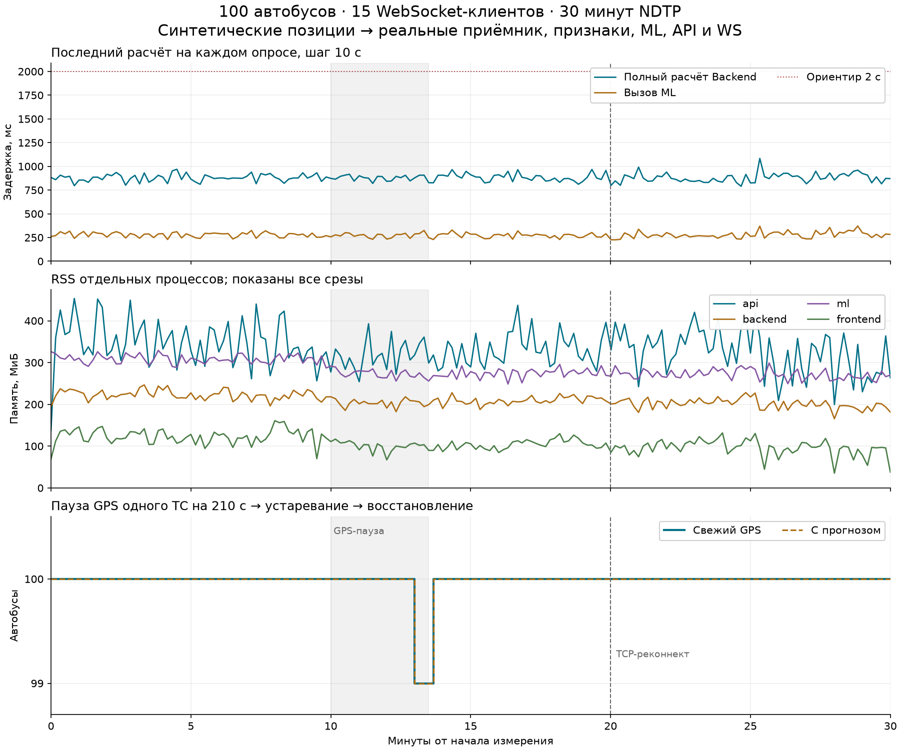

# BI и устойчивость: что изменено и как проверить

Документ закрывает две технические недоработки проверки: отсутствие сравнения сохранённого прогноза с фактом и недостаточный масштаб испытания потока. Оценку по критериям назначает жюри; результаты ниже не заменяют score ML на платформе.

## BI: одна цель, первый прогноз, наблюдённый факт

В официальной `/analytics` панель **«Факт и сохранённый прогноз»** берёт данные из `/api/v1/analytics/forecast-evaluation`. Раньше её график использовал временной ряд, где прогнозные значения официального Backend были `null`. Теперь сравниваются два значения задержки **для одного автобуса и одной плановой остановки**, а не текущая задержка сети с будущим средним.

- Backend фиксирует первый успешный ответ модели при `600 < план − T <= 900 с`. Более поздние пересчёты не перезаписывают его. Резервные оценки исключены.
- Фактическая задержка — наблюдённое прибытие минус план. В архиве источник — фактическая строка расписания, доступная только после времени прибытия. В NDTP — последовательно сопоставленное посещение остановки. Пропавший GPS не считается подтверждением опоздания.
- Пока плановый срок не наступил, запись имеет статус `pending`; после срока без факта — `awaiting_observation`. Факт и ошибка в обоих случаях `null`. Подтверждённый исход получает статус `observed`. Перемотка архива назад скрывает факты, ещё не доступные в этом срезе.
- SQLite сохраняет первый прогноз и исход после перезапуска. Ключ пространства данных включает режим, хеш плана и версию модели. Предел — **20 000 записей на весь журнал**, включая старые планы; самые старые удаляются. Локальный путь: `ml/data/predictions.sqlite3`, настройка: `PREDICTION_JOURNAL`. В Compose подключён отдельный том `forecast-journal`; удаление тома удаляет историю.
- MAE считается по всем сохранённым подтверждённым парам выбранных планов. API возвращает до 200 строк, сначала последние подтверждённые; график показывает до 60 пар, таблица — 12 строк. Фильтр текущего риска не применяется к прошлым исходам. Эти границы подписаны в панели.

В интерфейсе видны первый выпуск, плановое время цели, исходный горизонт, прогнозная и фактическая задержки, абсолютная ошибка. Отрицательная задержка означает раннее прибытие. При отказе API панель показывает ошибку и кнопку повтора.

Снимки наполненной панели в Chrome: [светлая тема](../reports/bi-evaluation-light-2026-09-26.png), [тёмная тема](../reports/bi-evaluation-dark-2026-09-26.png). Дополнительно проверена ширина 390 px: таблица прокручивается внутри карточки, страница не расширяется за экран. Перезапуск отдельного Backend с тем же SQLite сохранил все 274 прогноза и 229 подтверждённых исходов.

### Сохранённый результат на официальном архиве

[Исходный JSON](../reports/forecast-evaluation-replay-2026-09-26.json) получен реальными весами ExtraTrees на срезах 07:27–08:20 с шагом 30 секунд: **274 первых прогноза, 229 подтверждённых пар, 39 будущих целей, 6 целей без наблюдения**, MAE подтверждённых пар **53,98 с**. Это проверка интеграции журнала, **не независимая оценка точности**: архив test ранее использовался при выборе модели; результаты нельзя напрямую сравнивать с MAE по другим строкам или скрытым score.

Для воспроизведения после подготовки Python и официальных CSV по [ml/README.md](../ml/README.md):

```sh
PYTHONPATH=ml:src ml/.venv/bin/python scripts/audit-forecast-evaluation.py \
  > reports/forecast-evaluation-replay-local.json
```

Скрипт проверяет неизменность первого прогноза, горизонт и причинную доступность наблюдения. Без `--journal` используется новая БД в памяти. Чтобы сразу показать наполненную панель, создайте отдельный журнал командой с `--journal ml/data/bi-review.sqlite3`, затем запустите локальный контур с тем же планом и часами:

```sh
PYTHONPATH=ml:src ml/.venv/bin/python scripts/audit-forecast-evaluation.py \
  --journal ml/data/bi-review.sqlite3 > reports/forecast-evaluation-replay-local.json
PREDICTION_JOURNAL=ml/data/bi-review.sqlite3 REPLAY_SPEED=0 \
  REPLAY_START='2026-01-06 08:20:00' pnpm hackathon
```

Откройте [аналитику локального контура](http://127.0.0.1:4173/analytics?source=official). При обычном запуске с пустой БД панель ожидает фактического прибытия: заранее готовые результаты в живой поток не подмешиваются. В Docker путь журнала — внутри отдельного тома; приведённые команды относятся к локальному Python.

## Устойчивость: 100 автобусов и 15 читающих клиентов

Генератор [ndtp-fleet-load.py](../scripts/ndtp-fleet-load.py) создаёт **синтетический план и позиции**, упаковывая их в бинарный NDTP 6.2. Проходят настоящие TCP-приёмник, история, признаки, обученная модель, Backend, API и WebSocket по адресу сайта. Это дополнение к [проверке образа организаторов](20-reliability-benchmark.md), а не выдача своего генератора за официальный эмулятор.

Сценарий: 100 сопоставленных устройств, пакет от каждого каждые 5 с (**20 кадров/с**), 30 минут наблюдения, 15 одновременно читающих WS-клиентов. Перед замером подаётся 30 минут исторических точек; они исключены из задержки доставки. На 600-й секунде GPS одного автобуса выключается на **210 с**, превышая порог свежести 180 с. На 1200-й секунде TCP-соединение всех устройств разрывается и восстанавливается через 2 с. Остановка потока не удаляет последнюю позицию. Отдельный опрос карточки `vehicle-900000` подтвердил переход `active/ready` → `stale/stale_gps` с `predicted_delay_sec=null` → `active/ready`: в четырёх срезах с устаревшим GPS координата и timestamp оставались последними известными.

Обнаруженное в предварительном прогоне отключение всех 15 клиентов исправлено: полные первые снимки создавали буфер >1 МБ даже у быстрого клиента. Теперь отправитель ждёт завершения записи каждого кадра; общий срок отправки пачки ограничен 3 с. Параллельная отправка клиентам и запрет перекрывающихся пачек сохраняют ограниченную очередь. Тест проверяет доставку снимка >2 МБ и отключение зависшего сокета.

История NDTP ограничена одновременно 1500 пакетами на устройство и 30 минутами по времени; при обрыве сохраняется последняя позиция. Для ExtraTrees больше не вычисляется неиспользуемая последовательность из 30 временных корзин для GRU. Числовые признаки, веса, ML-горизонт и правила предупреждений не изменены; равенство признаков проверено тестом, повторный аудит сохранил 95 первых предупреждений / 92 верных / 3 ложных / 28 пропущенных.

`coalescedPackets` означает объединённые запросы на пересчёт, а не отброшенные GPS: каждый принятый кадр сначала попадает в ограниченную историю. Вместо очереди из отдельных инференсов на каждый кадр используется один ожидающий сигнал обновления; `forecastPending` показывает этот сигнал.

[85 отдельных наблюдений карточки ТС](../reports/reliability-fleet-faults-2026-09-26.json) сохраняют сырые позиции, статус, возраст GPS и наличие прогноза до/после отказа. Все проверки этого отчёта прошли; TCP переподключён на 1202-й секунде по журналу генератора.

### Измеренный результат 26 сентября 2026

[Полный JSON, 181 выборка](../reports/reliability-fleet-100-2026-09-26.json), [16 пройденных проверок](../reports/reliability-fleet-acceptance-2026-09-26.json). Код: `87e5175`; Apple M4, 10 логических CPU, 16 ГиБ RAM, macOS arm64, Node 24.19. Это локальные процессы, не повторная сборка контейнеров. Измеряемые исходники не менялись за 1800 с; их SHA-256 включены в JSON.

| Показатель | P50 | P95 | P99 / максимум |
|---|---:|---:|---:|
| Полный расчёт Backend | 877,40 мс | **948,76 мс** | 992,02 / 1083,32 мс |
| Вызов ML | 281,18 мс | **324,20 мс** | 370,01 / 371,33 мс |
| HTTP `/forecast`, включая чтение JSON | 56,26 мс | 90,41 мс | 312,21 / 324,63 мс |
| Timestamp нового GPS → получение читающим WS-клиентом | 6,09 с | **10,69 с** | 11,69 / 11,82 с |

Последняя строка — вся доставка через дискретный поток и обновления UI, **не обещание <2 с до экрана**. Критерий низкой задержки инференса проверяется отдельной строкой ML; ориентир 2 с выдержан и полным расчётом Backend. Из 311 610 измерений доставки исключены старые повторные позиции и предзагруженная история.

Принято **35 958** новых кадров, **19,98 кадров/с**. HTTP-ошибки, ошибки NDTP, неизвестные устройства, переходы API в устаревшее состояние, резерв ML, неожиданные закрытия и ошибки WS — **0**. Получено **877 425 сообщений WS**, из них 26 955 heartbeat. В 181 опросе не было ожидающего пересчёта. История не превышала **36 100 пакетов / 361 на устройство**, после паузы — 36 058. На срезах 780–810 с один автобус имел старый GPS и не получал прогноз; далее восстановлены все 100.

| Процесс | RSS начало → конец, МиБ | Пик | Медианы последовательных окон по 5 минут, МиБ |
|---|---:|---:|---|
| API | 138,0 → 263,7 | 453,5 | 359,7 · 333,1 · 315,8 · 333,3 · 346,8 · 308,7 |
| Backend | 193,9 → 181,6 | 246,6 | 224,9 · 221,5 · 206,1 · 208,8 · 206,5 · 196,6 |
| ML | 326,3 → 270,1 | 329,1 | 311,0 · 308,7 · 269,7 · 277,0 · 274,1 · 266,6 |
| Frontend/Vite | 69,1 → 37,6 | 160,9 | 124,0 · 126,0 · 103,3 · 106,5 · 101,8 · 96,4 |

RSS API в начале ещё прогревается; поэтому одного сравнения первого и последнего значения недостаточно. По полному ряду и медианам окон на этом интервале нет последовательного накопления памяти. Это ограниченное свидетельство устойчивости конкретного стенда, не доказательство отсутствия всех возможных утечек.



График построен по **всем** выборкам, без сглаживания и исключения пиков. Повторное построение (нужен необязательный `matplotlib`):

```sh
ml/.venv/bin/python scripts/plot-fleet-report.py \
  reports/reliability-fleet-100-2026-09-26.json \
  reports/reliability-fleet-100-2026-09-26.png
```

### Повторить нагрузку

Нужны подготовленные Python, Node/pnpm, веса и официальные CSV, как для `pnpm hackathon`. Сначала создайте отдельный учебный план и запустите сервисы в первом терминале:

```sh
ml/.venv/bin/python scripts/ndtp-fleet-load.py prepare \
  --plan docker/local-data/fleet-load --vehicles 100 --interval 5
TELEMETRY_MODE=ndtp LIVE_PLAN_DIR="$PWD/docker/local-data/fleet-load" \
  PREDICTION_JOURNAL=ml/data/fleet-load.sqlite3 pnpm hackathon
```

Во втором терминале включите поток, дождитесь строки `warmHistoryFrames`, оставьте генератор работать:

```sh
ml/.venv/bin/python scripts/ndtp-fleet-load.py feed \
  --plan docker/local-data/fleet-load --seconds 1860 \
  --pause-at 600 --pause-seconds 210 --reconnect-at 1200
```

Сразу после прогрева в третьем терминале:

```sh
BENCH_SOAK_SECONDS=1800 BENCH_SOAK_INTERVAL=10 BENCH_WS_CLIENTS=15 \
  TRANSIT_WS_URL=ws://127.0.0.1:4173/api/v1/stream \
  BENCH_SOAK_OUTPUT=reports/reliability-fleet-local.json \
  node scripts/benchmark-soak.mjs
python3 scripts/verify-fleet-report.py reports/reliability-fleet-local.json
```

Повторное испытание требует заново созданного текущего плана. Для отдельных портов используются переменные `TRANSIT_API_URL`, `TRANSIT_BACKEND_URL`, `TRANSIT_ML_URL`, `TRANSIT_SITE_URL`, `TRANSIT_WS_URL` и параметр генератора `--port`. Измеритель сохраняет CPU, ОС, память, commit и хеши исходников; изменение измеряемого кода во время прогона помечается в отчёте. Поле `commit` указывает версию до добавления самого отчёта.

`backendPipelineMs` включает сбор признаков, ML и сборку результата; `mlInferenceMs` — вызов ML. Отдельная метрика `eventToWebSocketMs` считает время от нового timestamp GPS до первого получения клиентом, включая секундную точность NDTP и пятсекундный такт WS. Она **не равна времени инференса**. Клиенты читают данные, но не рисуют 15 браузерных карт; сетевой путь локальный. Во время прогона дополнительно кратко проверен Chrome: в 3D созданы все 100 моделей автобусов, ошибок JavaScript нет; FPS этой проверкой не измерялся. Память снимается раз в 10 с через `lsof`/`ps`, сводится в окна по пять минут. Один 30-минутный прогон не доказывает отсутствие утечек при многочасовой работе.

Проверяющий скрипт требует полного времени, 100 наблюдённых машин, 15 клиентов, потока 19–21 кадров/с, P95 расчёта и ML <2 с, отсутствия ошибок HTTP/WS/NDTP, ограниченной истории, перехода 100→99 свежих ТС и восстановления до 100. Он не объявляет отсутствие утечек только по RSS.

## Регрессионные проверки

- `pnpm check`: типы frontend/API, lint, **123 теста**, production-сборка.
- Python runtime: **95 тестов прошли**, один тест отсутствующего производного submission исключён; файл тестов необязательного Torch runtime не запускался. Проверялся используемый ExtraTrees, модель не переобучалась.
- Chrome: **2 теста** новой панели — реальный ответ API, причинные поля, обе темы, неизвестный план, отказ журнала и повторная загрузка. На наполненном архиве дополнительно просмотрены обе темы.
- Первый прогноз после перезапуска, неизвестные исходы, перемотка архива, фильтры и ограничение БД проверены в `ml/tests/test_evaluation.py`; наблюдение цели после выхода из прогнозного окна — в `ml/tests/test_warning_outcomes.py`.

```sh
pnpm check
PYTHONPATH=ml:src ml/.venv/bin/python -m pytest ml/tests \
  --ignore=ml/tests/test_sasha_runtime.py -k 'not saved_submission' -q
OFFICIAL_BASE_URL=http://127.0.0.1:4173 pnpm exec playwright test \
  --config playwright.official.config.ts tests/official-e2e/forecast-evaluation.spec.ts
```
