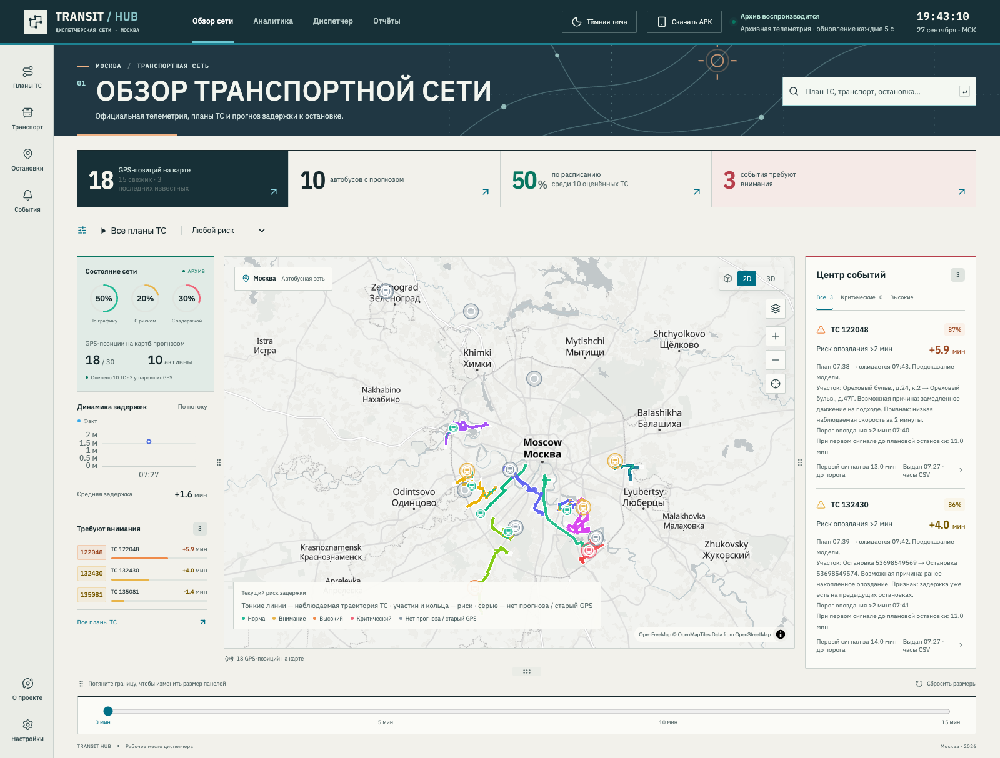

# Финальная проверка основного этапа — 27 сентября 2026

Проверен код `752405a`: ветка `codex/26-criteria-evidence` от `c0cc766` объединена с исправлениями `main` (`1ebb5cc`). Активная модель — **`olya-extra-trees-osm-v1`**. Контрольная сумма весов внутри собранного Docker-образа совпала с файлом репозитория:

```text
59c9bde7f2fe68ab95c75132959c4a223e925d83aebc387897116be7e17400c0
```

[Машиночитаемый протокол](../reports/final-criteria-verification-2026-09-27.json) содержит версии окружения, хеши исходников, перечень браузерных сценариев и происхождение каждого результата. [Матрица пяти критериев](22-criteria-evidence.md) связывает их с рубрикой. Баллы назначает жюри; суммарная оценка 26/26 здесь не присваивается.

## Сборка и тесты

| Проверка | Результат |
|---|---|
| `pnpm check` | Типы frontend/API, lint, **155 тестов**, production-сборка — успешно |
| `pnpm ml:test` | **149 тестов прошли**, включая три новых сценария сохранения неуспешного живого аудита |
| Полный `tests/official-e2e` в Chrome | **15/15**, без пропусков, повторных попыток и нестабильных результатов; 36,2 с |
| Docker Compose | Собраны все четыре образа; ML, Backend и API прошли healthcheck; frontend отдаёт архивный дашборд |
| Модель в Docker | Версия, 64 признака и хеш весов соответствуют активной OSM-модели |

**Всего 319 автоматических тестов.** В первом полном браузерном запуске два сценария ожидали старое название кнопки «Посмотреть транспорт на линии». Для официального режима она теперь называется «Посмотреть транспорт на карте»; селекторы обновлены, затем весь набор заново прошёл. Проверки поведения сохранены.

Браузерный стенд: отдельный проект Compose, официальный архив, `REPLAY_START='2026-01-06 07:27:00'`, `REPLAY_SPEED=0`. Проверены реальная модель и API; управляемые случаи отказов, погоды, дорожных событий и ответов GigaChat в соответствующих браузерных сценариях подставляются тестами. Внешние платные сервисы этот набор не аттестует. Команда повторения после запуска Docker:

```sh
pnpm check
pnpm ml:test
OFFICIAL_BASE_URL=http://127.0.0.1:8080 pnpm exec playwright test --config playwright.official.config.ts
```

В локальном проверочном стенде использовался порт 19080, чтобы не затронуть пользовательский сайт. В Python остался один предупреждающий вывод о совместимости `httpx`/Starlette; ошибок тестов нет.

## Ранние предупреждения

На финальном коде повторён `scripts/audit-early-warnings.py`. **Все 96 наблюдённых исходов полностью совпали** с [опубликованным OSM-аудитом](../reports/early-warning-audit-2026-09-27-osm.json): 95 нарушенных плановых сроков, предупреждённых за 630–780 с, 92 подтверждённых риска >120 с, 4 ложных сигнала. Из 120 опозданий >120 с предупреждены 92; пропущены 28. В семи подтверждённых случаях предыдущее наблюдаемое отклонение при сигнале было неположительным.

Отдельно выполнен новый сценарий официального NDTP-эмулятора с `--previous-stop-offset-sec 30` и `--require-no-existing-delay`. Вход, сопоставление и настоящая модель работали: 78 кадров, 0 ошибок разбора, отклонение **−23 с**, вероятность риска **8,97–10,83%**. До закрытия окна предупреждение не возникло; [JSON сохраняет все 47 наблюдений и причину завершения](../reports/ndtp-live-on-time-osm-2026-09-27.json). Этот результат не заменяется прежним успешным прогоном с уже наблюдаемым опозданием. Фиксация неуспешного исхода и безопасное завершение эмулятора теперь проверяются автоматически.

## Нагрузочный прогон на другом компьютере

Участник подтвердил успешное завершение **30 минут / 100 ТС / 15 читающих WebSocket-клиентов** для активной OSM-модели. Повторный запуск отменён по его прямому указанию. Исходный `reliability-fleet-osm-2026-09-27.json` в репозиторий ещё не передан, поэтому статус этого результата — **подтверждение участника**, а числовые показатели нового прогона не опубликованы и локально не проверены.

После получения исходного файла:

```sh
python3 scripts/verify-fleet-report.py reports/reliability-fleet-osm-2026-09-27.json
```

Нужно также сверить версию и хеш модели с приведёнными выше. До этого числовые показатели в [протоколе производительности](20-reliability-benchmark.md) и [отчёте дополнительных возможностей](additional-features-report.md) относятся к своим сохранённым прогонам; исторические значения не переписаны под новый сценарий.

## Снимок интерфейса

На финальном Docker-стенде заново снят обзор: явно видны «Архив воспроизводится», «Планы ТС», прогнозы, события и ползунок. Подложка карты загружена; проверка отдельного обозначения NDTP входит в полный браузерный набор.



## Что требуется извне

Действующее расписание и текущие назначения `unit_id → tr_id` должны быть подтверждены организаторами/оператором. [Исследование источников](27-live-ndtp-plan-source.md) содержит конкретные файлы, поля, временную зону, проверку ID и подключение после получения. Январский архив и план интеграционного стенда не являются действующим эксплуатационным расписанием.

Платформенный **score 1.0** используемой модели подтверждён участником; снимок кабинета показывает 1.00000. Для независимого сопоставления этой оценки с активными весами нужен ID попытки и загруженный CSV; [контрольные суммы и происхождение](../submission/README.md) сохранены отдельно.

Ссылки для формы сдачи собраны в [SUBMISSION.md](../SUBMISSION.md): репозиторий, инструкция для жюри, техническая документация и отчёт по производительности/дополнительным возможностям. Исходный датасет, закрытые назначения устройств и ключи в этот набор изменений не включены.
